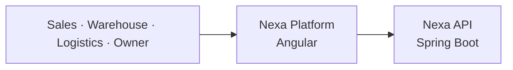

<div align="center">


# Nexa Platform

Internal operations workspace for Nexa Suite's cold-chain organization.

[](https://angular.dev/)
[](https://www.typescriptlang.org/)
[](https://material.angular.dev/)
[](#architecture)
[](#current-status)

[Platform](https://github.com/nexa-suite/platform) · [Portal](https://github.com/nexa-suite/portal) · [API](https://github.com/nexa-suite/api)

</div>

---

## Overview

Nexa Platform is the independent Angular application for internal Sales, Warehouse, Logistics, Owner, administration and tenant operations.

## Role in the Nexa Ecosystem

Platform serves internal organization users. It provides an operationally dense foundation for future workflows and consumes the shared Nexa API when approved vertical slices are implemented.



## Repository Map

| Repository | Responsibility | Technology |
|---|---|---|
| **Platform** — This repository | Internal operations for Sales, Warehouse, Logistics and Administration | Angular |
| [Portal](https://github.com/nexa-suite/portal) | Buyer-facing B2B experience | Angular |
| [API](https://github.com/nexa-suite/api) | Business rules, contracts, security and persistence authority | Spring Boot |

## Scope

- Internal operational shell.
- Independent Angular workspace.
- Layered DDD structure per bounded context.
- Nexa tokens and Angular Material adaptation.
- Baseline EN/ES translation surface.

## Architecture

Presentation depends on Application. Application depends on Domain. Infrastructure implements future ports without leaking technical concerns into Domain.

No business capability, authentication, persistence or API integration is implemented in this baseline.

## Bounded Contexts

- Shared.
- IAM.
- Tenant Management.
- Catalog Management.
- Sales.
- Warehouse.
- Logistics.
- Invoicing.

## Tech Stack

- Angular 22 standalone components, routing, SCSS and strict mode.
- Angular Material 22 and Angular CDK 22.
- TypeScript, RxJS, Signals and HttpClient.
- ngx-translate 18.
- Node.js and npm.

## Getting Started

```bash
npm ci
npm start
```

Open [http://localhost:4200](http://localhost:4200).

## Available Commands

```bash
npm test
npm run build
```

## Project Structure

```text
docs/assets/                 # Local Nexa documentation asset
public/assets/               # Branding and baseline translations
src/app/core/                # Shell, configuration and shared presentation
src/app/<bounded-context>/   # domain, application, infrastructure, presentation
src/styles.scss              # Nexa tokens and global styles
```

## Current Status

This repository currently contains the approved architecture baseline.

Business capabilities, API integrations, persistence and security will be implemented incrementally through vertical slices.

Release v0.1.0 records this approved baseline; it does not claim production capability.

## Out of Scope

- Authentication.
- API integration.
- Real business screens.
- Persistence.
- Production deployment.
- Complete Vue parity.

## Roadmap

1. Architecture baseline.
2. First approved vertical slice.
3. Security and tenant isolation.
4. Persistence and contracts.
5. Progressive legacy parity.
