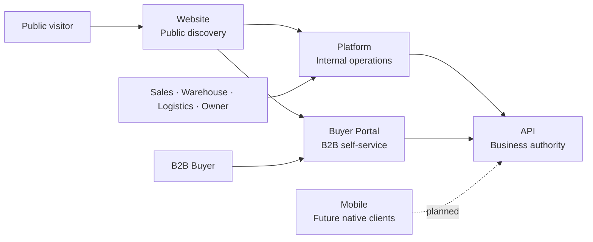

<div align="center">


# Nexa Platform

Internal operations workspace for Sales, Warehouse, Logistics, Company Ownership and Administration.

[](https://angular.dev/) [](https://www.typescriptlang.org/) [](https://material.angular.dev/) [](https://github.com/nexa-suite/platform/releases/latest)

[Latest Release](https://github.com/nexa-suite/platform/releases/latest) · [Changelog](./CHANGELOG.md) · [Contributing](./.github/CONTRIBUTING.md) · [Security](./.github/SECURITY.md)

**Current repository:** Platform

[Website](https://github.com/nexa-suite/website) · [Platform](https://github.com/nexa-suite/platform) · [Portal](https://github.com/nexa-suite/portal) · [API](https://github.com/nexa-suite/api) · [Mobile](https://github.com/nexa-suite/mobile)

</div>

---

## Overview

Nexa Platform is the independent Angular application for internal sales, warehouse, logistics, company ownership and administration workflows. It is not the buyer-facing B2B product.

## Role in the Nexa Ecosystem

Platform owns internal operations experience. Portal owns buyer self-service. Both consume API through approved contracts; Platform is not security authority.

## Nexa Suite Architecture



## Repository Map

<table>
  <tr>
    <td width="50%"><h3>Website</h3><p>Public commercial discovery entry point.</p><p>Status: repository foundation target v0.1.0.</p><p><a href="https://github.com/nexa-suite/website">Repository</a></p></td>
    <td width="50%"><h3><b>Platform</b></h3><p>Internal operations for Sales, Warehouse, Logistics, Company Ownership and Administration.</p><p>Angular · v0.2.1 target.</p><p><a href="https://github.com/nexa-suite/platform">Current repository</a></p></td>
  </tr>
  <tr>
    <td width="50%"><h3>Buyer Portal</h3><p>Buyer-facing catalog, requests, orders and delivery visibility.</p><p>Angular · v0.2.1 target.</p><p><a href="https://github.com/nexa-suite/portal">Repository</a></p></td>
    <td width="50%"><h3>API</h3><p>Business and integration authority.</p><p>Java 26 / Spring Boot 4.1 · v0.3.0 target.</p><p><a href="https://github.com/nexa-suite/api">Repository</a></p></td>
  </tr>
  <tr>
    <td width="50%"><h3>Mobile</h3><p>Future native buyer and field-operation clients.</p><p>Status: planned · v0.1.0 target.</p><p><a href="https://github.com/nexa-suite/mobile">Repository</a></p></td>
    <td width="50%"></td>
  </tr>
</table>

## Scope

- Internal Angular application.
- Approved API contracts only; no security authority.
- Areas: IAM, Tenant Management, Catalog Management, Sales, Warehouse, Logistics and Invoicing.
- Current maturity: Foundation. Planned areas remain not yet delivered until approved vertical slices exist.

## Architecture

Presentation depends on Application. Application depends on Domain. Infrastructure remains outside Domain. Frontend domain models will be introduced with an approved vertical and mapped from explicit API contracts.

## Bounded Contexts

| Area | Maturity |
|---|---|
| IAM | Foundation / planned |
| Tenant Management | Foundation / planned |
| Catalog Management | Foundation / planned |
| Sales | Planned |
| Warehouse | Planned |
| Logistics | Planned |
| Invoicing | Planned |

## Tech Stack

Angular 22, TypeScript strict mode, Angular Material/CDK 22, Signals, RxJS, ngx-translate 18, SCSS and npm.

## Getting Started

```bash
npm ci
npm start
```

Open [http://localhost:4200](http://localhost:4200).

## Available Commands

```bash
npm run validate:catalog-assets
npm test
npm run build
```

## Project Structure

```text
src/app/core/                         # Shell, routes and language service
src/app/shared/presentation/components # Reusable visual components
src/app/shared/application/utilities   # Pure address, date and number utilities
public/catalog-items/                  # Manifest-validated canonical media subset
src/styles/                            # Tokens, typography, motion, Material and a11y
docs/releases/                        # Versioned release notes
```

## Documentation

- [Release notes](./docs/releases/)
- [Repository release policy](./.github/RELEASE_POLICY.md)

## Current Release

v0.2.1 is the repository experience and governance update. It adds no functional capability.

## Roadmap

Future vertical slices require explicit contracts, identity, tenant rules and runtime/browser evidence.
